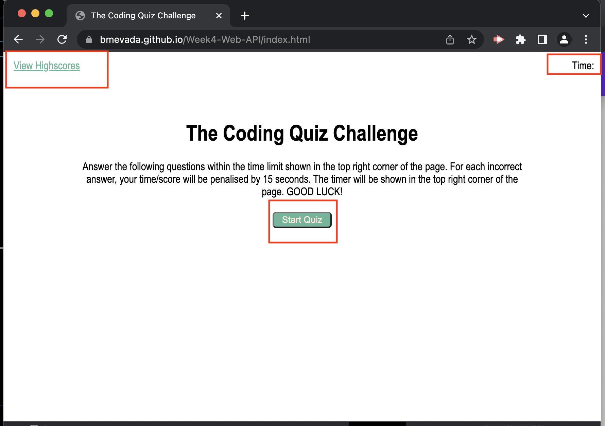
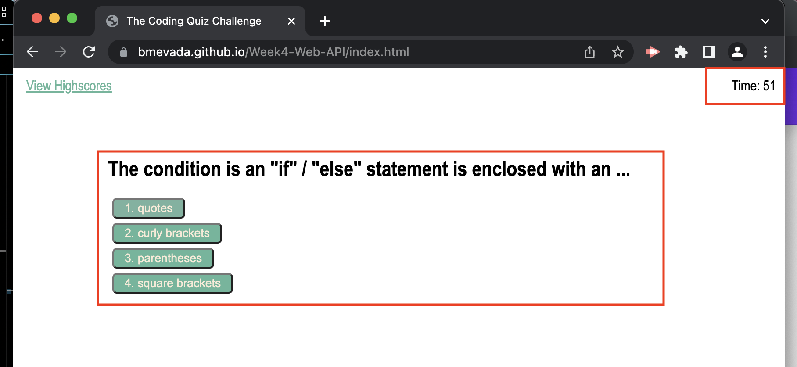
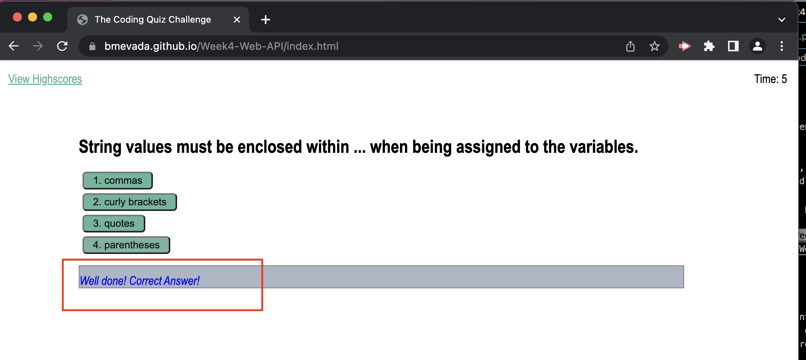
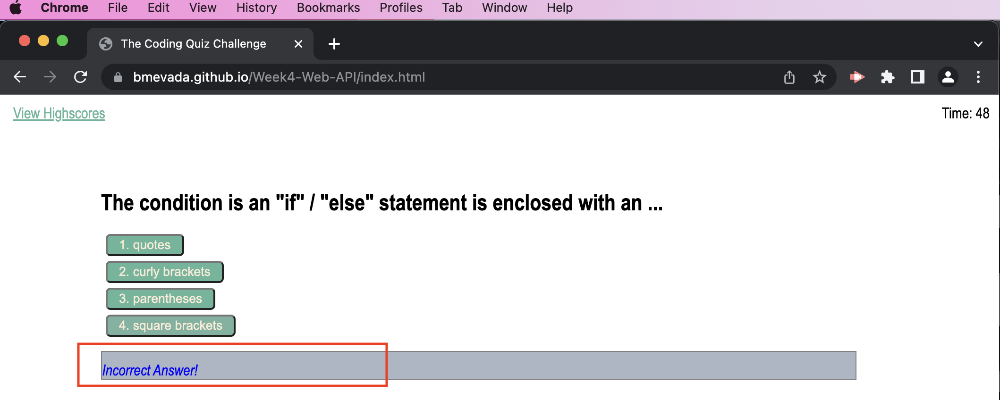
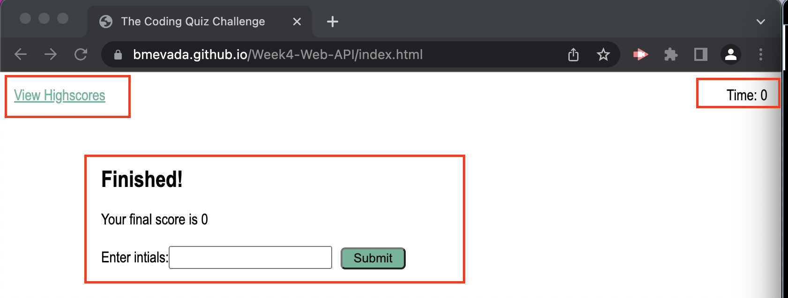
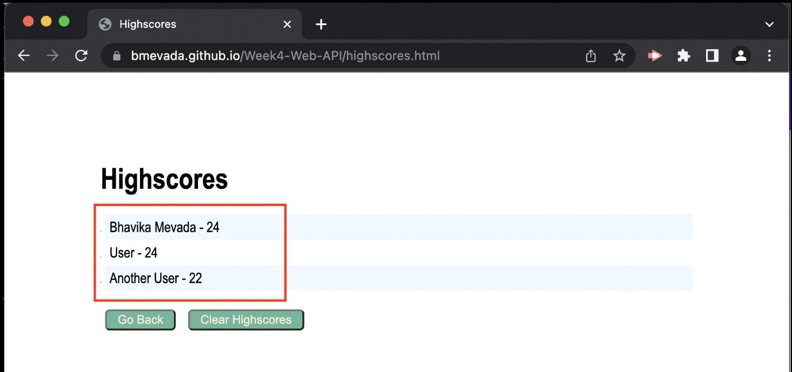
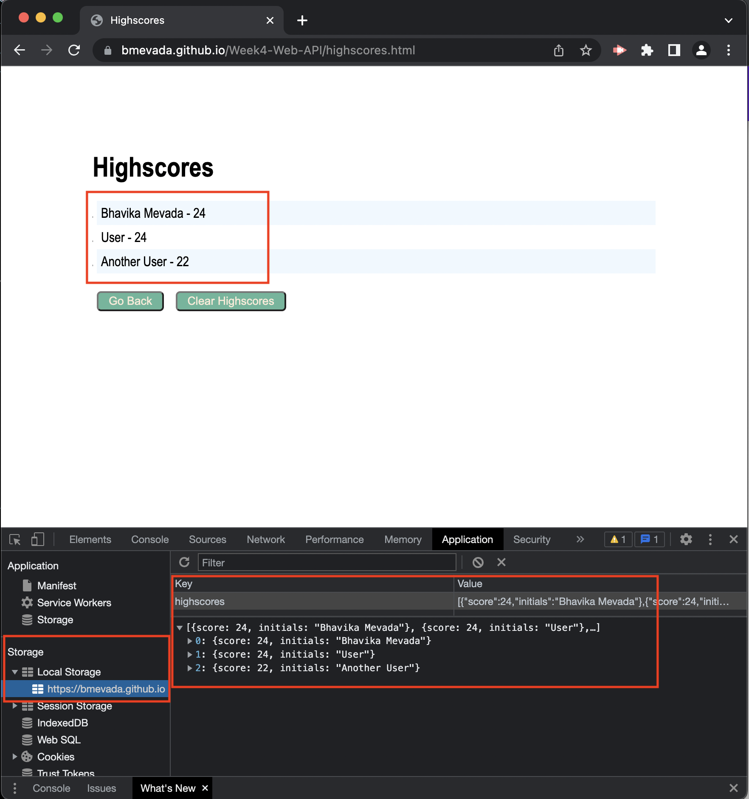

# 04 Web APIs: Code Quiz

## Challenge

An interactive coding challenge has been created which includes multiple-choice questions, to demonstrate the journey to become a full stack developer. 

This coding challenge invites the user to a timed coding quiz, which runs in the browser and features dynamically updated HTML and CSS powered by JavaScript code. It is a clean and polished, responsive user interface that adapts to multiple screen sizes. 

## Deployed Website

[Link to website] https://bmevada.github.io/Week4-Web-API/index.html

[Link to Github] https://github.com/bmevada/Week4-Web-API.git

Overall, the code is clean, polished, and responsive user interface.

## User Story

AS A coding boot camp student

I WANT to take a timed quiz on JavaScript fundamentals that stores high scores

SO THAT I can gauge my progress compared to my peers

## Acceptance Criteria

GIVEN that the user is presented with 'The Coding Challenge Quiz'. The user is presented with rules of the quiz and is able to view the high scores prior to starting the quiz.

WHEN the user clicks on the start button

THEN the timer starts and presented with a question and a choice of answers

WHEN the user answers a question correctly, feedback is provided for 3 seconds stating that thhe choice they have made is correct

THEN the user will presented with another question from the question bank

WHEN the user answers a question incorrectly, feedback is provided for 3 seconds stating the choice they have made is wrong

THEN time is subtracted from the clock

WHEN all questions are answered or the timer reaches 0

THEN the game is over

WHEN the game is over

THEN the user can save their name and save their score

WHEN the user clicks on submit

THEN the user is presented with all scores to guage their progress compared to their peers. This is presented to them in descending order of the scores

THEN the user is given an option to click "Go Back" to rest the quiz and starting over or "Clear Highscores"

ALL high scores submitted are stored in the local storage, so that once the user/s complete the quiz they are able to compare their progress and review their ranking. 

